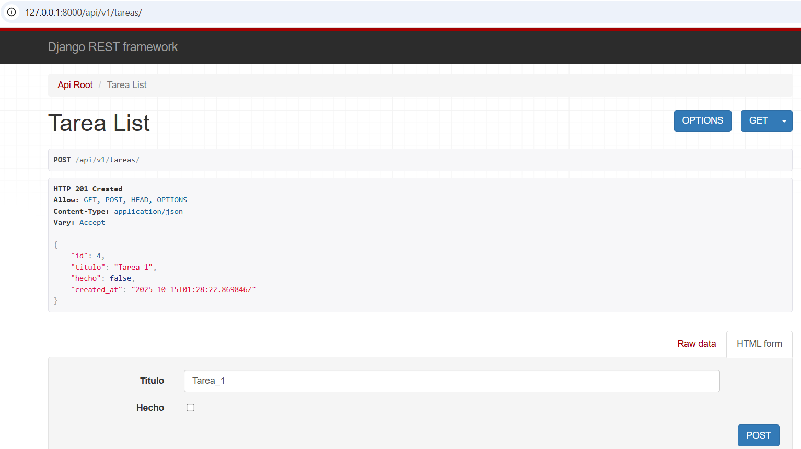
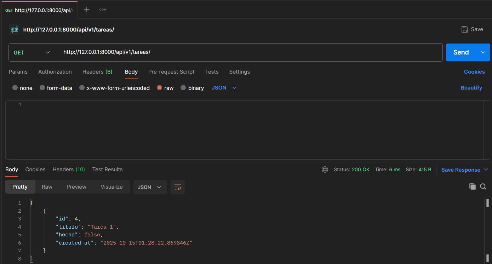
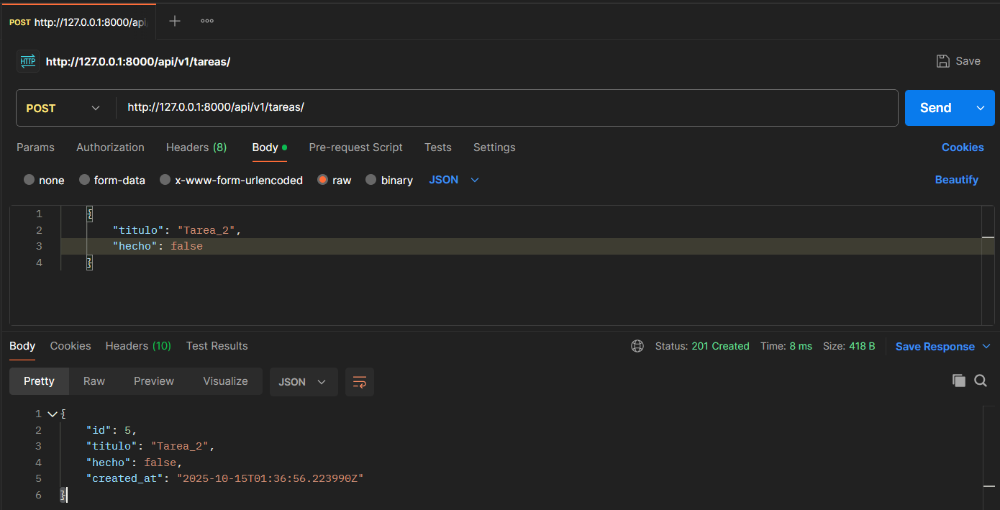
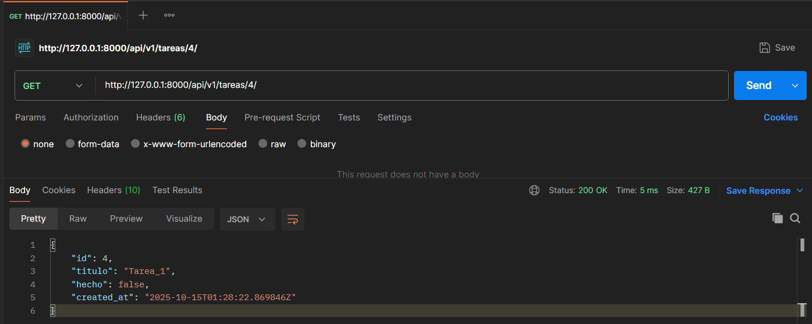
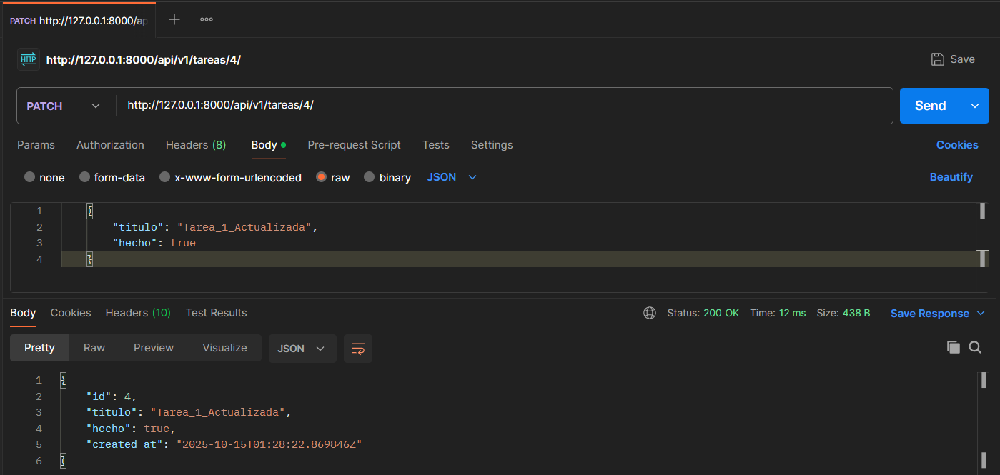
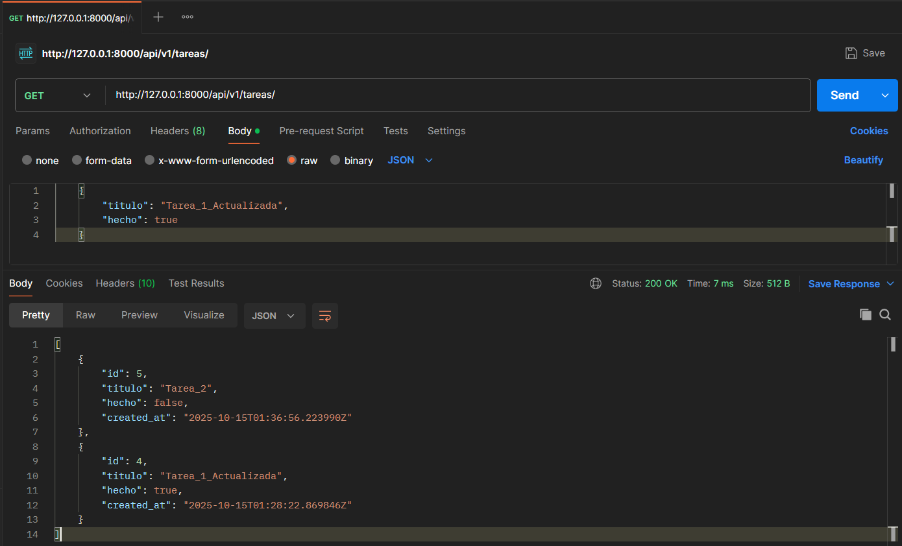
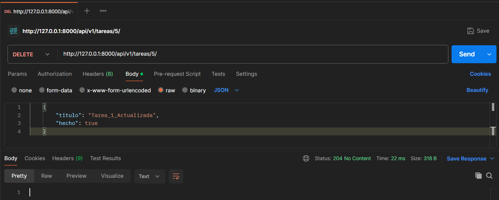
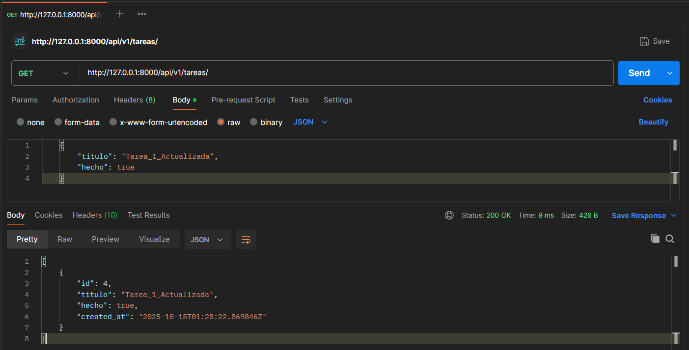
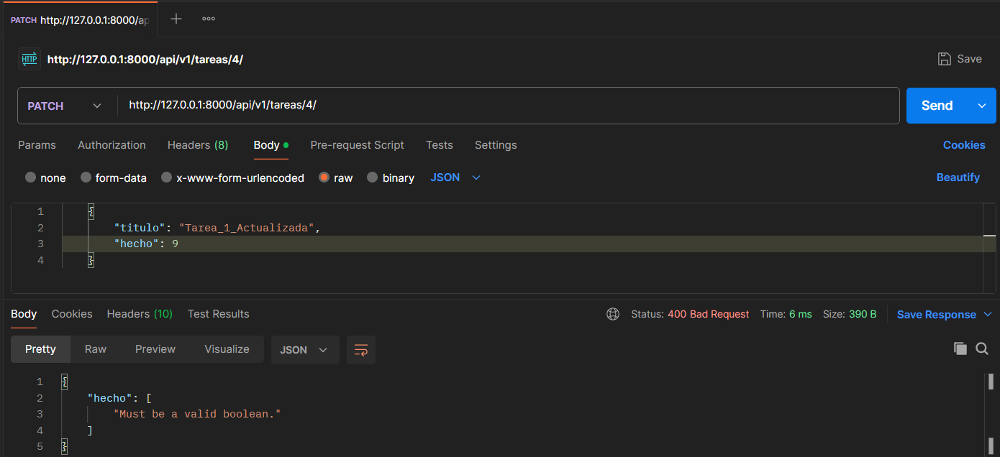
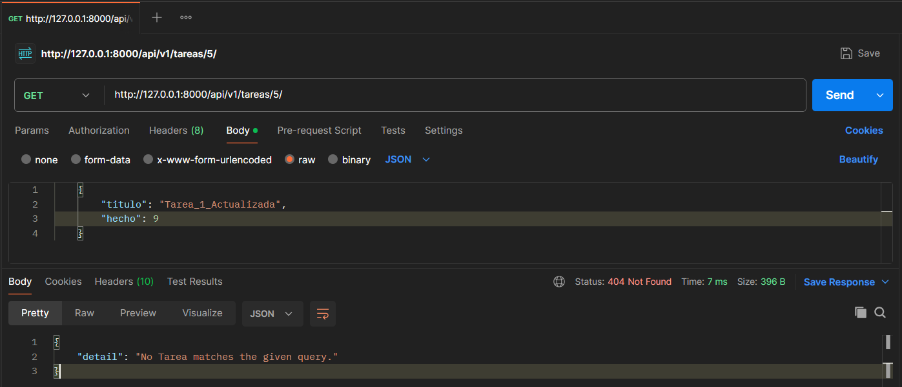

# Listar tareas
curl -X GET http://127.0.0.1:8000/api/v1/tareas/

# Crear tarea
curl -X POST http://127.0.0.1:8000/api/v1/tareas/

# Detalle de una tarea
curl -X GET http://127.0.0.1:8000/api/v1/tareas/4/

# Actualizar una tarea
curl -X PATCH http://127.0.0.1:8000/api/v1/tareas/4/ \

# Borrar una tarea
curl -X DELETE http://127.0.0.1:8000/api/v1/tareas/5/

# Status 400

# Status 404

